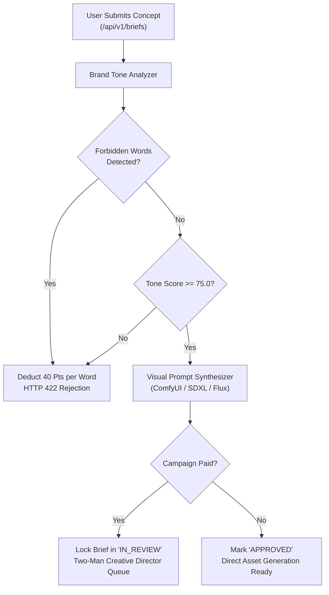

# StudioForge V2 — Architectural Flowcharts

## 1. Creative Brief & Tone Governance Flowchart

```mermaid
flowchart TD
    A["User Submits Concept\n(/api/v1/briefs)"] --> B["Brand Tone Analyzer"]
    B --> C{"Forbidden Words\nDetected?"}
    C -- Yes --> D["Deduct 40 Pts per Word\nHTTP 422 Rejection"]
    C -- No --> E{"Tone Score >= 75.0?"}
    E -- No --> D
    E -- Yes --> F["Visual Prompt Synthesizer\n(ComfyUI / SDXL / Flux)"]
    F --> G{"Campaign Paid?"}
    G -- Yes --> H["Lock Brief in 'IN_REVIEW'\nTwo-Man Creative Director Queue"]
    G -- No --> I["Mark 'APPROVED'\nDirect Asset Generation Ready"]
```
